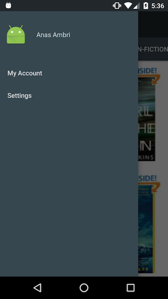

# DesignSupportLibraryDemo

A project to demo the Android design support library. It was presented at the [Android Montreal developers group](http://slides.com/anasambri/deck) in January 2016.

## Purpose

The goal was to demonstrate most components of the design library with the least amount of code. The components implemented here are :

- NavigationView
- TabLayout
- AppBarLayout
- CoordinatorLayout, with FloatingActionButton

### Starting point

### Final result

